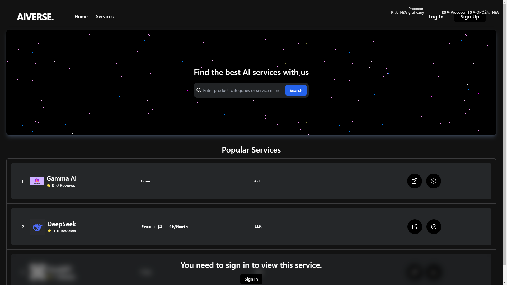
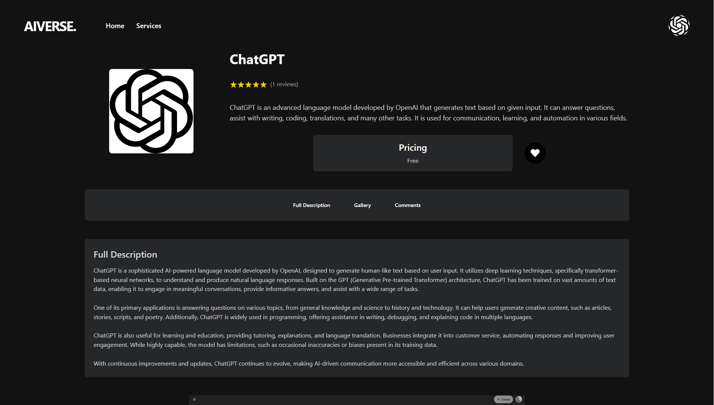
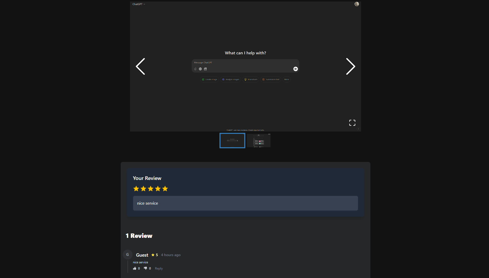

# AIverse

This is a web application that allows users to discover, add, and review AI models. It serves as a community-driven catalog where users can share experiences and opinions, helping others choose the right model. Users can browse models by category, access detailed information, and contribute by adding new models with descriptions and links. The platform also enables users to rate and review models, creating a transparent ranking system. Each model has a dedicated page with key details, performance insights, and user feedback, making it easier to evaluate and compare AI solutions.

## Features 
 - UI created with Tailwind CSS and Framer Motion
 - Several Authentication Options
 - Self added AI pages
 - Review and Comment AI pages

## Live URL
https://aiverse-ebon.vercel.app/

## Screenshots

### Home Page

### Login Page

### Sign Up Page

### Search Services Page

### AI Service Page

### Profile

### Add Service Form

## Technologies

### Frontend

 - React JS
 - Typescript
 - Framer Motion + Tailwind CSS + Mantine UI

### Backend
 - .NET Core

### Database
 - Supabase (PostgreSQL)

### Development Tools
 - Postman
 - VS Code
 - Prettier

## Contact
In case of any issues or for any other inquiries, please contact me at mateuszsuplice@gmail.com or bartoszsosnica@gmail.com

